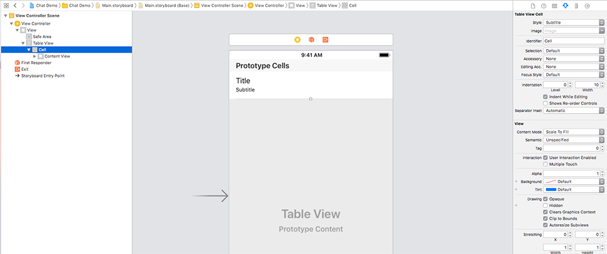

## TableViews

Table Views are a fundemental part of working in iOS. They are responsible for displaying a large amount of scrollable data - your contacts list for example. 

They can seem confusing at first, but once you've set up a few, they'll become relatively intuative to work with. They work on a delegate design pattern, and in fact have **two** delegates. One for it's data source and another for common interations with the table view, for example when a user selects a row, you'll likely want to perform an action of some kind. 

> If you need to refresh what delegates are and hwo they work, go and read the notes on them [here](https://github.com/KyleGoslan/Digital-Media-Design/tree/master/05%20-%20Delegates)

You **must** adopt the `UITableViewDataSource` protocol. As the name suggest this is responsible for providing the table view with the data it is going to display. All the other delegate methods in the `UITableViewDelegate` protocol are optional.  

### Setting Up The Storyboard

Add a Table View from the object library to a view controller, then add a single Table View Cell to the storyboard. Select the cell and give it an identifier in the attributes inspector on the right (see the image below). In this example I've just used "Cell" as the identifier. 



Create an `IBOutlet` to the relevant view controller for the table view called `tableView` (just like you would do for a label). You can also set the dataSource and delegate properties in the storyboard by ctrl click and dragging from the Table View to the view controller icon (The yellow icon with the square in it in the bar above the view controller) exactly the same as you would do to set a Map View delegate.

**Note:** Setting the dataSource and delegate properties can be done via code as well, usually in the viewDidLoad. Adding the following code would do the exact same thing as the step above, and produce an error until you complete th next step. If you're not sure why you get an error now, go and read the [notes on delegates](https://github.com/KyleGoslan/Digital-Media-Design/tree/master/05%20-%20Delegates) 

```swift
tableView.dataSource = self
tableView.delegate = self
```

At the bottom of your view controller file (outside everything else) add the following: 

```swift
extension ViewController: UITableViewDataSource {

}

extension ViewController: CLLocationManagerDelegate {

}
```
